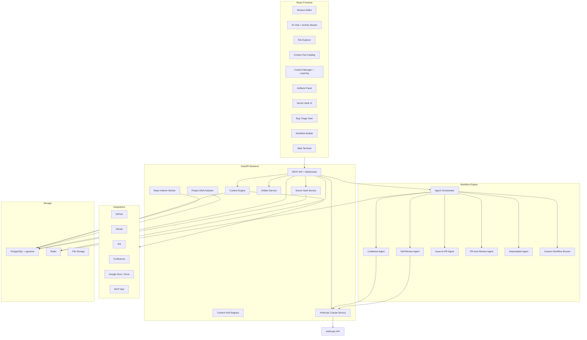
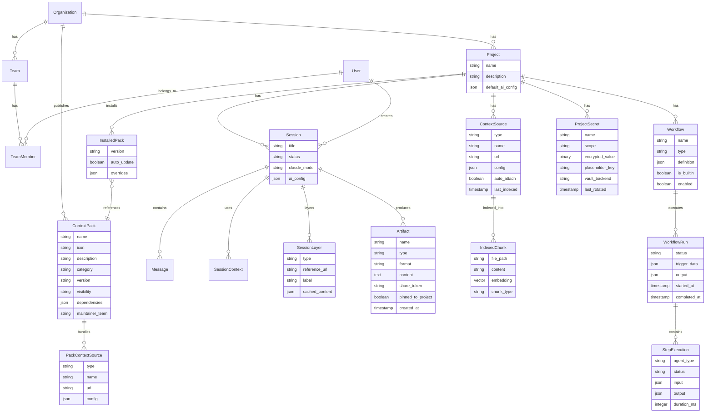

# Orbit: Context-First AI IDE

## Why Orbit Exists

Ambient requires manually adding context repos for every new session -- users forget, AI output suffers. Ambient shows "thinking..." with no visibility into what's happening. Secrets get pasted into prompts. Valuable team research in GitHub and Google Docs goes undiscovered.

**Orbit fixes all of this.** Context is a first-class, persistent citizen -- defined once at the project level via a hub of one-click knowledge packs, and auto-available in every session. The AI shows exactly what it's doing. Secrets never reach the model. Team knowledge feeds a virtuous cycle of better AI output.

## Orbit vs Ambient -- At a Glance

- **Context management**: Ambient = add repos one-by-one every session. Orbit = Context Hub with one-click packs (like OperatorHub), persistent across sessions.
- **Context layering**: Ambient = repos only. Orbit = repos + PRs + Jira tickets + Confluence pages + Google Docs + code snippets + past sessions.
- **Workflows**: Ambient = 4 session templates (triage/bugfix/feature/exploration). Orbit = 5 built-in multi-agent patterns + custom visual workflow builder + YAML definitions.
- **AI transparency**: Ambient = "thinking..." spinner. Orbit = Cursor-style expandable activity stream showing every action in real-time.
- **Secrets**: Ambient = bearer token in YAML file. Orbit = encrypted vault + auto-detection + placeholder system + audit log.
- **Artifacts**: Ambient = transcripts + logs. Orbit = rich reports, generated code, diagrams, exportable + shareable + pinnable.
- **Integrations**: Ambient = GitHub + GitLab. Orbit = GitHub + GitLab + Jira + Confluence + Google Docs + MCP Hub.
- **Project intelligence**: Ambient = AgentReady (separate tool). Orbit = built-in AgentReady + auto-discover CLAUDE.md/AGENTS.md + auto-generate project DNA + skill-spotter.
- **Model access**: Ambient = Claude Code CLI + K8s secret. Orbit = Anthropic API direct (Claude model version picker) + org-managed key.

---

## Architecture Overview




## Tech Stack

- **Frontend**: React 18 + TypeScript, Monaco Editor, TailwindCSS, Zustand (state), React Query
- **Backend**: Python 3.12, FastAPI, SQLAlchemy, Celery (background jobs)
- **Database**: PostgreSQL + pgvector (vector search), Redis (caching, sessions, Celery broker)
- **AI**: Anthropic API direct (Claude Sonnet 4 / Opus 4 / Haiku 3.5 -- user selectable)
- **Integrations**: GitHub API, GitLab API, Jira REST API, Confluence API, Google Docs/Drive API
- **Security**: AES-256-GCM secret vault, optional HashiCorp Vault / 1Password backends
- **Auth**: Red Hat SSO (OAuth2 / OIDC) + JWT tokens
- **Deployment**: Docker Compose (dev), Kubernetes/OpenShift (prod)

---

## Key Innovation #1: Context Hub

Inspired by OpenShift's OperatorHub. Instead of adding repos one-by-one (Ambient's pain point), browse a catalog and click a product to get everything.

### Context Packs

Pre-built bundles of knowledge for a product/service. Each pack contains:

- **Repos**: All relevant GitHub/GitLab repositories (auto-indexed)
- **Documentation**: Confluence spaces, Google Docs (folders or individual docs), README files, architecture docs
- **Issue Trackers**: Linked Jira projects, GitHub Issues boards
- **Architecture Knowledge**: Component diagrams, API contracts, data flows
- **Research Docs**: Team members' Google Docs, GitHub markdown research, investigation notes
- **Conventions**: Coding style guides, PR templates, naming conventions
- **Dependencies**: Related packs (e.g., "ODH" depends on "OpenShift" pack)

### Context Hub UI

Searchable card-grid catalog (like OperatorHub):

- Search bar, categories (by team, product, language, domain)
- Pack cards: name, icon, description, repo count, last updated, maintainer
- One-click install -- all context sources added to your project
- Pack detail page -- see contents, toggle individual items
- Dependency resolution -- installing "ODH" auto-suggests "OpenShift" pack

### Context Layering

After installing a pack, layer on task-specific context:

- **Paste a PR URL** -- AI fetches diff, comments, review history
- **Paste a Jira ticket** -- AI fetches description, comments, linked issues
- **Paste a Google Doc URL** -- AI fetches design specs, research, meeting notes
- **Link a Google Drive folder** -- AI indexes all docs, keeps in sync
- **Pin a specific file/directory** -- Browse indexed repos and pin
- **Paste a code snippet** -- Ad-hoc context
- **Reference a past session** -- Continuity across sessions

### Context Budget Indicator

Visual bar showing: tokens loaded vs model capacity, smart optimization (most relevant first), warnings when exceeding limits.

### Who Creates Packs

- **Org-published**: Teams maintain packs for their products (ODH team maintains ODH pack)
- **Auto-generated**: Point at a GitHub org or GitLab group, auto-create a pack from its repos
- **Personal**: Private packs for individual workflows
- **Versioned**: Packs update and re-index when underlying sources change

---

## Key Innovation #2: Workflow Engine

Multi-agent orchestration with 5 built-in patterns and custom user-defined workflows.

### 5 Built-in Workflow Patterns

**1. Codebase Agent** -- Always-on AI deeply integrated with project repos. Understands conventions, modules, architecture. Powers all other workflows.

**2. Self-Review Reflection** -- After code generation, a review pipeline runs:

- Architecture agent checks structural soundness
- Linter agent checks style compliance
- Security agent checks for vulnerabilities
- Final agent synthesizes and improves the code

**3. Issue-to-PR Automation** -- From a Jira ticket or GitHub Issue:

- Codebase Agent analyzes issue and identifies relevant code
- Code generation agent creates the implementation
- Self-Review pipeline validates
- PR agent creates branch, commits, opens draft PR

**4. PR Auto-Review** -- When a PR is created:

- Codebase Agent fetches diff, understands the change
- Review agent checks for bugs, edge cases, performance
- Style agent checks conventions compliance
- Summary agent writes structured review comment

**5. Dependabot Auto-Merge** -- For dependency update PRs:

- Risk assessment agent evaluates the update
- Codebase Agent checks for breaking changes against actual usage
- Auto-merge if low risk, flag for human review if high risk

### Custom Workflow Builder

- **Visual Builder**: Drag-and-drop pipeline editor. Pick agent steps from a palette, connect them, configure each step.
- **YAML Definition**: Power-user option:

```yaml
name: "Bug Fix Pipeline"
trigger: manual
steps:
  - agent: codebase_analysis
    config:
      focus: "bug_related_files"
      input_from: trigger.issue_url
  - agent: code_generation
    config:
      instruction: "Fix the bug described in the issue"
      context_from: previous_step
  - agent: self_review
    config:
      checks: [architecture, linting, security, tests]
  - agent: create_pr
    config:
      branch_naming: "fix/{issue_id}-{short_desc}"
      draft: true
```

- **Template Gallery**: Clone and customize built-in workflows
- **Execution Monitor**: Real-time step status, logs, duration

---

## Key Innovation #3: Session Artifacts

Every session and workflow produces artifacts -- generated files, reports, code patches, analysis documents.

### Artifact Types

- Bug triage reports (root cause, affected files, risk, suggested fix)
- Code review reports (findings, suggestions, severity)
- Generated code (patches, diffs, full files)
- Architecture diagrams (auto-generated Mermaid/PlantUML)
- Session transcripts (Markdown, JSON, PDF)
- Workflow execution reports (step-by-step log with timing)
- Session metrics (token usage, duration, cost)

### Artifacts Panel

- List view with type icons, timestamps, previews
- Inline preview (Markdown rendered, code highlighted, diagrams visualized)
- Export as Markdown, HTML, PDF
- Shareable links (RBAC-scoped)
- Pin to project (persists across sessions)
- Re-use as context in future sessions

### Auto Session Summaries

When a session ends, AI generates: goals, outcomes, decisions, files changed, next steps. This feeds the Knowledge Feed / Smart Recall system.

---

## Key Innovation #4: Secret Vault

Zero-exposure secret management. Secrets never reach the AI model.

### How It Works

1. **Auto-detection**: Real-time scanning of prompts before sending to AI. Pattern matching for GitHub tokens, AWS keys, JWTs, API keys, connection strings. High-entropy string detection.
2. **Warning popup**: "This looks like a GitHub token. Store it in the vault?"
3. **Placeholder system**: AI sees `{{secret:github_token}}` -- real value injected only at code execution runtime
4. **Encrypted storage**: AES-256-GCM per project. Optional HashiCorp Vault, 1Password, AWS Secrets Manager backends.
5. **Scoped access**: Personal, team, or project-level secrets with RBAC
6. **Audit log**: Every secret access tracked
7. **Sensitive file protection**: Block `.env`, `.ssh/`, credential files from context

---

## Key Innovation #5: Project DNA + AgentReady

Auto-discover and auto-generate project intelligence from code.

### Auto-Discovery

- Read existing `CLAUDE.md`, `AGENTS.md`, `.claude/` directories from indexed repos
- Import rules, skills, agent definitions, hooks as part of Context Packs
- Cross-tool compatibility (respects Cursor rules, Windsurf configs, etc.)

### Auto-Generation

- Analyze repos and generate project knowledge from actual code patterns
- Discover tech stack, frameworks, conventions from code (not docs)
- Extract architecture understanding from directory structures and imports

### Built-in AgentReady

- When a repo is added to a Context Pack, auto-score across 25 research-backed attributes
- Display readiness tier (Platinum/Gold/Silver/Bronze) in the Hub
- Actionable suggestions: "Missing tests for auth module", "Architecture docs are stale"

### Skill/Pattern Discovery (like skill-spotter)

- Auto-discover reusable patterns across all repos in a pack
- Suggest Skills that can be added to the pack
- Common error handling, API patterns, test patterns, deployment patterns

---

## Key Innovation #6: AI Transparency

Cursor-style expandable activity stream. No more "thinking..." black box.

### Level 1: Status Line (always visible)

> **Analyzing codebase...** (3 files read, 2 searches) - 4s elapsed

### Level 2: Expandable Actions (one-click expand)

```
> Reading src/auth/login.ts                     done 0.3s
> Searching for "token refresh" in 12 repos     done 1.2s
> Reading JIRA-4521 description                 done 0.8s
> Analyzing root cause...                       running
```

### Workflow Progress (for multi-agent workflows)

```
Bug Triage Pipeline                              Step 2/4
----------------------------------------------------
[done] Step 1: Codebase Analysis    12 files      3.2s
[..]   Step 2: Root Cause Analysis  analyzing...  1.8s
[ ]    Step 3: Generate Fix         pending
[ ]    Step 4: Create PR            pending
```

---

## Model Access

### Claude Only (for now)

- **Anthropic API** direct integration (no LiteLLM proxy needed initially)
- **Model picker**: Users select Claude version per session/chat:
  - Claude Sonnet 4 (default -- fast, balanced)
  - Claude Opus 4 (complex reasoning, architecture analysis)
  - Claude Haiku 3.5 (quick tasks, cheap)
- **Org-managed API key**: Stored as environment variable or in Secret Vault. Individual users never need their own key.
- **Future upgrade path**: Add LiteLLM Proxy for multi-provider support (GPT, Granite, Ollama)

### Auth Flow

```
User --> Red Hat SSO (OAuth2/OIDC) --> Orbit Web App --> Anthropic API (org key)
```

---

## Data Model




---

## Project Structure

```
orbit/
  frontend/                        # React app
    src/
      components/
        Editor/                    # Monaco editor wrapper
        Chat/                      # AI chat panel
          ActivityStream/          # Expandable activity log
          ModelPicker/             # Claude version selector
        ContextHub/
          HubCatalog/              # Searchable card grid of packs
          PackDetail/              # Pack detail page
          PackCreator/             # Create/edit context packs
        ContextManager/            # Active context panel + layering
        ContextBudget/             # Token usage indicator
        Artifacts/
          ArtifactList/            # List of session artifacts
          ArtifactPreview/         # Inline preview
          ArtifactShare/           # Share link generation
          SessionSummary/          # Auto-generated session summary
        SecretVault/
          VaultManager/            # Secret CRUD UI
          SecretScanner/           # Prompt scanning warnings
        BugTriage/                 # Bug triage view
        Workflows/
          WorkflowBuilder/         # Visual drag-and-drop builder
          WorkflowMonitor/         # Execution status view
          WorkflowTemplates/       # Template gallery
          AgentStepPalette/        # Agent step picker
        FileExplorer/              # File tree
        Terminal/                  # Web terminal (xterm.js)
        Layout/                    # Main layout shell
      hooks/                       # Custom React hooks
      stores/                      # Zustand stores
      api/                         # API client layer
      types/                       # TypeScript types
  backend/
    app/
      api/
        routes/
          auth.py                  # Red Hat SSO + JWT auth
          projects.py              # Project CRUD
          sessions.py              # Session management
          context.py               # Context engine endpoints
          context_hub.py           # Context Hub / Pack CRUD
          ai.py                    # AI chat/completion endpoints
          integrations.py          # GitHub/GitLab/Jira endpoints
          bugs.py                  # Bug triage endpoints
          workflows.py             # Workflow CRUD + execution
          artifacts.py             # Artifact CRUD, export, share
          secrets.py               # Secret vault CRUD, scan
      core/
        config.py                  # Settings
        security.py                # Auth utilities
        secret_vault.py            # Encrypted vault, placeholder system
        secret_scanner.py          # Auto-detect secrets in prompts
        database.py                # DB connection
      models/                      # SQLAlchemy models
      services/
        context_engine.py          # Smart context retrieval + ranking
        context_hub_service.py     # Pack registry, install, auto-generate
        project_dna_service.py     # Auto-discover/generate project knowledge
        agentready_service.py      # Repo readiness scoring
        ai_service.py              # Anthropic Claude API wrapper
        artifact_service.py        # Artifact generation, export, sharing
        secret_service.py          # Vault management
        indexer.py                 # Repo indexing service
        github_service.py          # GitHub API client
        gitlab_service.py          # GitLab API client
        jira_service.py            # Jira API client
        confluence_service.py      # Confluence API client
        google_docs_service.py     # Google Docs/Drive API client
      workflow_engine/
        orchestrator.py            # Main workflow executor
        agents/
          base_agent.py            # Base agent interface
          codebase_agent.py        # Codebase analysis agent
          codegen_agent.py         # Code generation agent
          review_agent.py          # Self-review agent
          pr_agent.py              # PR creation/review agent
          security_agent.py        # Security check agent
          linter_agent.py          # Style/lint agent
          custom_agent.py          # User-defined agent step
        builtin_workflows/
          issue_to_pr.py           # Issue-to-PR automation
          pr_auto_review.py        # PR auto-review
          dependabot_merge.py      # Dependabot auto-merge
          bug_triage.py            # Bug triage pipeline
        parser.py                  # YAML workflow parser
        models.py                  # Workflow execution state
      workers/
        index_worker.py            # Celery: repo indexing
        workflow_worker.py         # Celery: workflow execution
    alembic/                       # DB migrations
  docker-compose.yml
  README.md
```

---

## Implementation Phases

### Phase 1 -- Foundation (Week 1-2)

- Project scaffolding: React (Vite) + FastAPI + Docker Compose
- PostgreSQL + pgvector setup with Alembic migrations
- Redis for caching and Celery broker
- User auth: Red Hat SSO (OAuth2/OIDC) + JWT tokens
- Basic Project and Session CRUD API + UI
- Monaco Editor integration with basic file explorer
- Main layout shell (sidebar, editor pane, chat pane)

### Phase 2 -- Context Hub + Context Engine (Week 3-5)

- Context Pack data model: packs, pack sources, installed packs, versioning
- Context Hub UI: searchable card-grid catalog, pack detail page, install/uninstall
- Pack Creator: UI + API for teams to publish packs (repos, Jira boards, Confluence, Google Docs)
- Auto-generate packs: point at a GitHub org or GitLab group
- GitHub and GitLab repo integration (clone, index into pgvector)
- Context Layering UI: add specific PRs, Jira tickets, Google Docs, files, snippets, past sessions
- Context budget indicator (tokens used vs model limit)
- Auto-attach all installed pack context to new sessions

### Phase 3 -- Secret Vault + AI Chat + Activity Stream (Week 6-8)

- Secret Vault: AES-256-GCM encrypted storage, placeholder system (`{{secret:name}}`)
- Secret Scanner: auto-detect tokens/keys in prompts, warning popup, auto-redact
- Sensitive file protection: block `.env`, credential files from context
- Anthropic Claude API integration (Sonnet/Opus/Haiku version picker)
- Streaming chat with context-aware responses (secrets replaced with placeholders)
- Cursor-style expandable activity stream (Level 1 status line + Level 2 action rows)
- Agent Orchestrator: core engine for executing agent pipelines
- Base agent interface and agent registry
- Code generation with inline diff preview
- "Apply to file" action from chat responses

### Phase 4 -- Session Artifacts (Week 9-10)

- Artifact data model: types, formats, sharing
- Artifact generation: AI auto-produces structured artifacts during sessions/workflows
- Artifacts Panel UI: list view, inline preview (Markdown, code, diagrams)
- Export: Markdown, HTML, PDF
- Sharing: generate shareable links (RBAC-scoped)
- Pin to project: valuable artifacts persist across sessions
- Auto session summaries: AI generates structured summary on session end
- Session metrics: token usage, duration, cost breakdown

### Phase 5 -- Built-in Workflows (Week 11-13)

- Codebase Agent: always-on project-aware AI
- Self-Review Reflection: multi-agent review pipeline (architecture + linting + security)
- Issue-to-PR Automation: Jira/GitHub Issue to draft PR pipeline
- PR Auto-Review: automated first-pass code review
- Dependabot Auto-Merge: risk assessment + auto-merge
- Workflow execution monitor UI (real-time step status, logs, duration)
- Workflow pipeline progress in activity stream
- Each workflow run auto-generates an execution report artifact

### Phase 6 -- Custom Workflow Builder (Week 14-16)

- YAML workflow definition parser and validator
- Visual drag-and-drop workflow builder UI
- Agent step palette (pick from available agent types)
- Step configuration panels (per-agent settings)
- Workflow template gallery (clone and customize built-in workflows)
- Workflow versioning and history
- Execution monitoring dashboard

### Phase 7 -- Project DNA + AgentReady (Week 17-18)

- Auto-discover CLAUDE.md, AGENTS.md, .claude/ from indexed repos
- Import rules, skills, agent definitions into Context Packs
- Auto-generate project DNA from code analysis (tech stack, patterns, conventions)
- Built-in AgentReady scoring (25 attributes, tier display in Hub)
- Skill/pattern discovery (like skill-spotter) across pack repos
- Remediation suggestions for low-scoring repos

### Phase 8 -- Bug Triage (Week 19-20)

- Jira integration (import issues, sync status, bi-directional)
- GitHub Issues integration
- AI-powered root cause analysis (Codebase Agent + Context Engine)
- Suggested fix generation with diff view
- One-click branch creation and fix application
- Bug triage report artifact (shareable root cause analysis)
- Bug-to-fix workflow template (combines triage + Issue-to-PR)

### Phase 9 -- Advanced Features (Week 21-22)

- Confluence integration for docs context
- Google Docs/Drive integration (individual docs + folder sync)
- Web terminal (xterm.js + WebSocket)
- Team sharing (shared projects, sessions, workflows, artifacts)
- MCP Hub: browse and install MCP servers from the official registry
- Orbit MCP Server: expose Orbit as an MCP server for external control
- Context Packs can bundle MCP servers (knowledge + tools)
- Knowledge Feed: auto-discover research docs from team GitHub repos

### Phase 10 -- Polish and Deploy (Week 23-24)

- Organization management UI
- Role-based access control (org admin, team lead, member, viewer)
- Kubernetes/OpenShift deployment manifests
- Helm chart for production deployment
- Performance optimization (caching, lazy loading, pagination)
- Documentation and onboarding flow
- External vault backends (HashiCorp Vault, 1Password)
- Secret audit log

