# Orbit Architecture

> A complete technical reference for contributors, operators, and anyone evaluating the system.

---

## Table of Contents

1. [High-Level Overview](#1-high-level-overview)
2. [System Architecture](#2-system-architecture)
3. [Backend](#3-backend)
   - [Directory Layout](#31-directory-layout)
   - [Application Startup](#32-application-startup)
   - [API Routes](#33-api-routes)
   - [Database Models](#34-database-models)
   - [Services Layer](#35-services-layer)
4. [AI Pipeline](#4-ai-pipeline)
   - [Client Factory](#41-client-factory)
   - [Chat Stream Flow](#42-chat-stream-flow)
   - [Tool System](#43-tool-system)
   - [Context Assembly](#44-context-assembly)
   - [Conversation Cache & Compaction](#45-conversation-cache--compaction)
5. [MCP Integration](#5-mcp-integration)
6. [Context Pack System](#6-context-pack-system)
7. [Secrets & Vault](#7-secrets--vault)
8. [Cluster Management](#8-cluster-management)
9. [Frontend](#9-frontend)
   - [Directory Layout](#91-directory-layout)
   - [Routing](#92-routing)
   - [State Management](#93-state-management)
   - [API Layer](#94-api-layer)
   - [Streaming Chat](#95-streaming-chat)
10. [Authentication](#10-authentication)
11. [Deployment](#11-deployment)
    - [Local Development (Compose)](#111-local-development-compose)
    - [OpenShift (Manual Scripts)](#112-openshift-manual-scripts)
    - [OpenShift (Operator)](#113-openshift-operator)
12. [Data Flow Diagrams](#12-data-flow-diagrams)

---

## 1. High-Level Overview

Orbit is a self-hosted, AI-assisted workspace that combines project management, context-aware AI chat, secrets management, MCP tool integrations, and Kubernetes cluster operations into a single application.

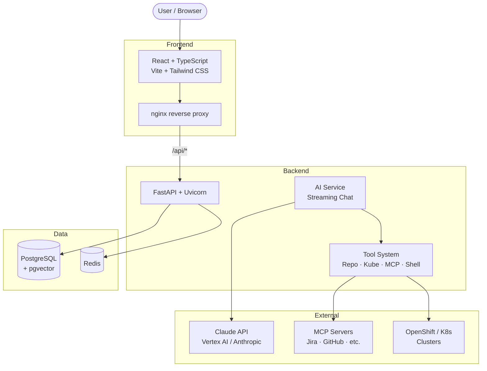

**Key design decisions:**

- **SSE over WebSocket** — AI chat uses Server-Sent Events via HTTP POST streaming, keeping the protocol simple and proxy-friendly.
- **In-process background tasks** — Git cloning, indexing, and context assembly run as FastAPI `BackgroundTasks`, not Celery (Celery is defined in Compose but unused in app code today).
- **Pluggable AI provider** — A single env var (`CLAUDE_PROVIDER`) switches between Vertex AI (GCP ADC) and direct Anthropic API key.
- **Encrypted-at-rest secrets** — AES-256-GCM with key derived from `SECRET_KEY`; secrets injected into tool inputs at runtime via `{{secret:name}}` placeholders.

---

## 2. System Architecture

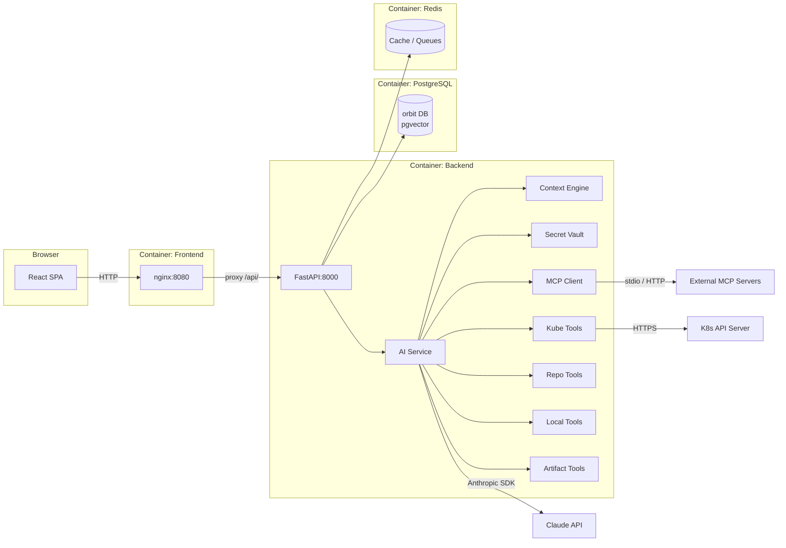

---

## 3. Backend

### 3.1 Directory Layout

```
backend/app/
├── main.py                  # ASGI entry: create_app()
├── application.py           # FastAPI factory, CORS, middleware, routers
├── api/routes/              # All REST endpoints
│   ├── ai.py                # /ai/models, /chat (SSE stream)
│   ├── auth.py              # /auth/login, /auth/token, /auth/me
│   ├── clusters.py          # Cluster CRUD + test-connection
│   ├── context.py           # Context sources + session layers
│   ├── context_hub.py       # Hub pack catalog (/hub/*)
│   ├── files.py             # Repo tree/file browsing
│   ├── projects.py          # Project CRUD + shares + runtime settings
│   ├── secrets.py           # Secret CRUD + scanning
│   ├── sessions.py          # Session CRUD + messages
│   ├── skills.py            # MCP skill CRUD + test/refresh
│   ├── threads.py           # Thread CRUD + thread chat
│   ├── workflows.py         # Workflow templates
│   └── ...
├── core/
│   ├── config.py            # Pydantic Settings (all env vars)
│   ├── database.py          # Async SQLAlchemy engine + session
│   ├── security.py          # JWT + OCP auth helpers
│   ├── secret_vault.py      # AES-256-GCM encrypt/decrypt
│   └── secret_scanner.py    # Detect leaked secrets in user input
├── middleware/
│   └── ocp_auth.py          # OpenShift X-Forwarded-User middleware
├── models/                  # SQLAlchemy ORM models
├── services/                # Business logic layer
└── workflow_engine/         # Multi-agent orchestration (experimental)
```

### 3.2 Application Startup

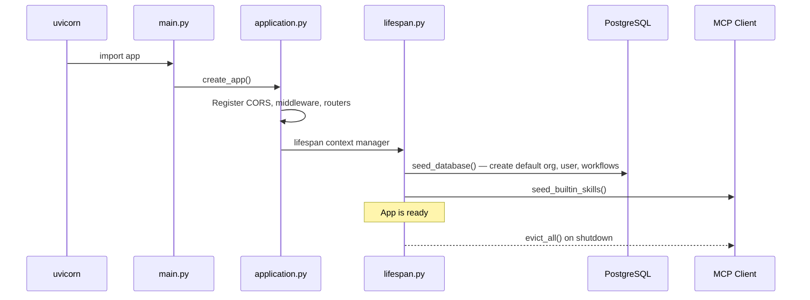

### 3.3 API Routes

| Area | Method | Path | Handler |
|------|--------|------|---------|
| **Auth** | POST | `/auth/login` | Login with credentials |
| | POST | `/auth/token` | Issue JWT |
| | GET | `/auth/me` | Current user profile |
| | GET | `/auth/mode` | Auth mode (jwt / ocp) |
| **Projects** | GET/POST | `/projects` | List / create |
| | GET/PUT/DELETE | `/projects/{id}` | Detail / update / delete |
| | GET/PUT | `/projects/{id}/runtime-settings` | Per-project AI config |
| | GET/POST/PATCH/DELETE | `/projects/{id}/shares/*` | Project sharing |
| **Sessions** | GET/POST | `/projects/{pid}/sessions` | List / create |
| | GET/PUT/PATCH/DELETE | `/projects/{pid}/sessions/{sid}` | Detail / update / delete |
| | POST/GET/DELETE | `/projects/{pid}/sessions/{sid}/messages` | Send / list / clear |
| **AI Chat** | GET | `/ai/models` | Available models |
| | POST | `/projects/{pid}/sessions/{sid}/chat` | SSE streaming chat |
| **Threads** | POST/GET | `…/sessions/{sid}/threads` | Create / list |
| | GET/DELETE | `…/threads/{tid}` | Detail / delete |
| | POST | `…/threads/{tid}/chat` | SSE streaming thread chat |
| **Context** | GET/POST/DELETE | `/projects/{pid}/context-sources` | Project context sources |
| | GET/POST/DELETE | `/sessions/{sid}/layers` | Session context layers |
| **Context Hub** | GET/POST | `/hub/packs` | Pack catalog |
| | GET/PUT/DELETE | `/hub/packs/{id}` | Pack detail |
| | GET/POST/DELETE | `/hub/projects/{pid}/installed-packs` | Install/uninstall |
| **Secrets** | GET/POST/PUT/DELETE | `/projects/{pid}/secrets/*` | Vault CRUD |
| | POST | `/scan-secrets` | Scan text for secrets |
| **Skills (MCP)** | GET/POST | `/skills` | List / register |
| | PUT | `/skills/{id}/configure` | Update config |
| | PUT | `/skills/{id}/toggle` | Enable/disable |
| | POST | `/skills/{id}/test` | Test connection |
| | POST | `/skills/{id}/refresh` | Refresh tool list |
| **Clusters** | GET/POST | `/projects/{pid}/clusters` | List / register |
| | GET/PUT/DELETE | `…/clusters/{cid}` | Detail / update / remove |
| | POST | `…/clusters/{cid}/test-connection` | Probe API server |
| **Files** | GET | `/projects/{pid}/repos` | List cloned repos |
| | GET | `…/repos/{rid}/tree` | Directory tree |
| | GET | `…/repos/{rid}/file` | File contents |
| **Artifacts** | GET | `…/sessions/{sid}/artifacts/tree` | Artifact file tree |
| | GET | `…/sessions/{sid}/artifacts/file` | Read artifact |
| | GET | `…/sessions/{sid}/artifacts/download` | Download artifact |
| **Settings** | GET/PUT | `/settings/runtime` | Global runtime settings |

### 3.4 Database Models

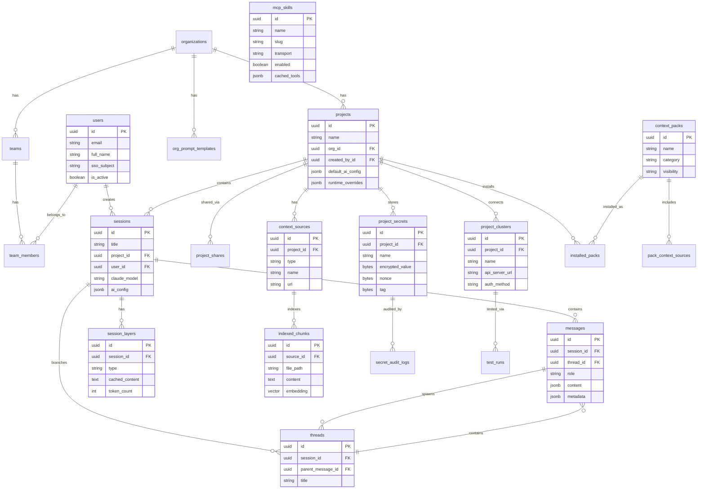

### 3.5 Services Layer

| Service | File | Responsibility |
|---------|------|----------------|
| **AI Client** | `ai_client.py` | Factory: cached `AnthropicVertex` or `Anthropic` client |
| **AI Service** | `ai_service.py` | Context assembly, streaming chat, tool loop, secret resolution |
| **Context Engine** | `context_engine.py` | CRUD for context sources and session layers |
| **Context Hub** | `context_hub_service.py` | Pack catalog, install/uninstall, background cloning |
| **Secret Service** | `secret_service.py` | Encrypt/decrypt secrets, rotation, audit logging |
| **Cluster Service** | `cluster_service.py` | Cluster CRUD, encrypted credentials, connection testing |
| **MCP Client** | `mcp_client.py` | MCP server connections, tool discovery, execution, pooling |
| **Repo Tools** | `repo_tools.py` | File tree/search/read on cloned repos |
| **Kube Tools** | `kube_tools.py` | Live Kubernetes cluster queries as AI tools |
| **Local Tools** | `local_tools.py` | Shell execution in cloned repos |
| **Artifact Tools** | `session_artifact_tools.py` | Read/write session artifact files |
| **Indexer** | `indexer.py` | Chunk text content into indexed_chunks |
| **GitHub Service** | `github_service.py` | Clone repos, fetch trees via GitHub API |
| **Runtime Settings** | `runtime_settings.py` | Merge env + DB settings, per-project overrides |

---

## 4. AI Pipeline

### 4.1 Client Factory

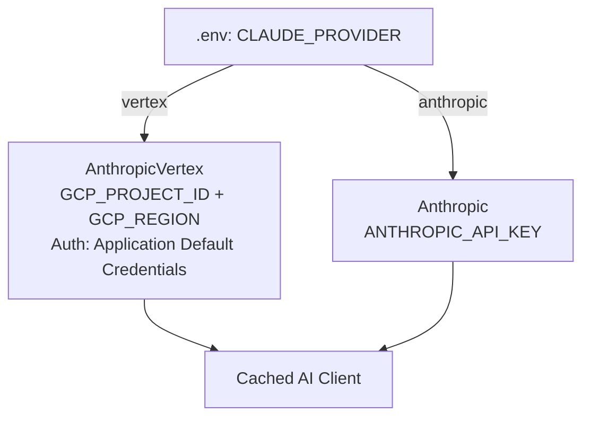

- **Vertex AI** authenticates via Google ADC. Locally, `~/.config/gcloud` is mounted read-only into the container. On OpenShift, use Workload Identity or a mounted service account key.
- **Anthropic** uses a direct API key from the environment.

### 4.2 Chat Stream Flow

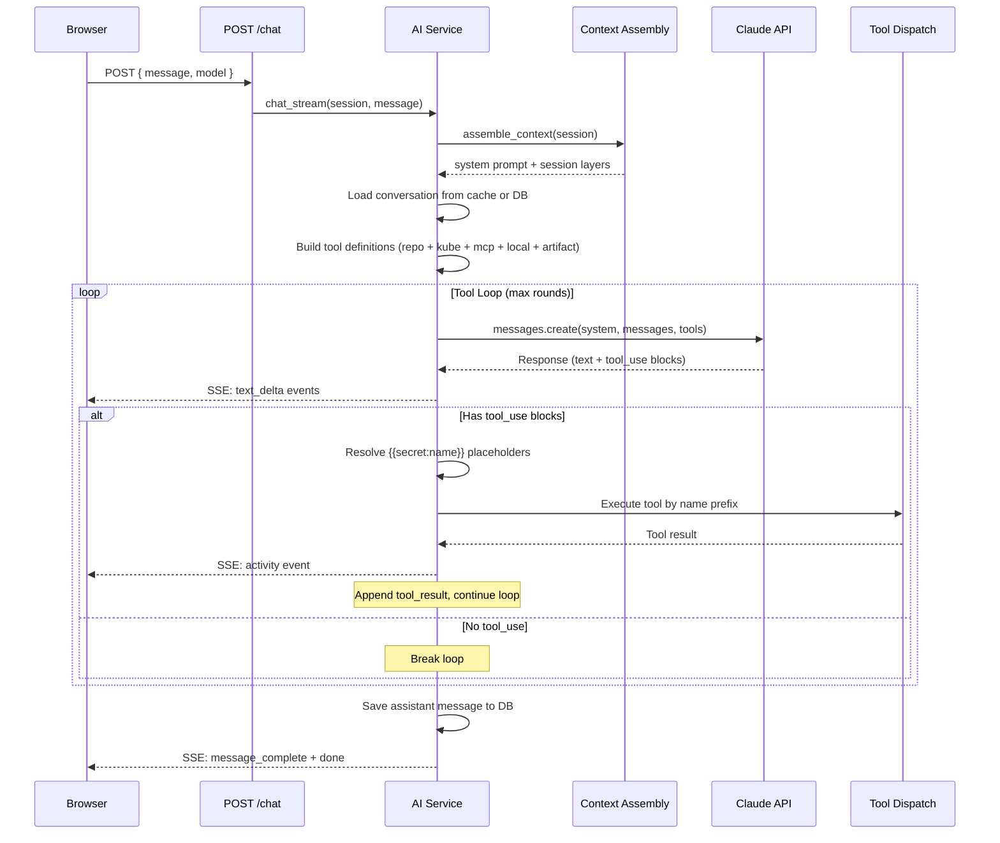

### 4.3 Tool System

Tools are registered dynamically based on what the project has attached:

```mermaid
graph TD
    AIS[AI Service]

    subgraph "Tool Definitions"
        RT[Repo Tools<br/>file_tree, file_read, file_search]
        KT[Kube Tools<br/>list_pods, get_logs, describe, etc.]
        MCPt[MCP Tools<br/>mcp_{slug}__{tool_name}]
        LT[Local Tools<br/>shell_exec in cloned repo]
        SAT[Artifact Tools<br/>read_artifact, write_artifact, list_artifacts]
    end

    AIS -->|has context sources| RT
    AIS -->|has clusters| KT
    AIS -->|has clusters + repos| LT
    AIS -->|has enabled skills| MCPt
    AIS -->|always| SAT

    subgraph "Tool Dispatch"
        AIS -->|name starts with mcp_| MCPt
        AIS -->|name starts with kube_| KT
        AIS -->|name = shell_exec| LT
        AIS -->|name starts with artifact_| SAT
        AIS -->|default| RT
    end
```

### 4.4 Context Assembly

The system prompt is built from multiple layers:

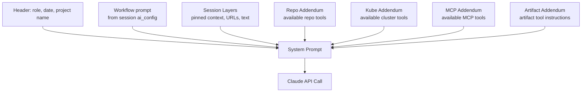

Session layers (`session_layers` table) are converted to prompt text by `session_layer_prompt.layer_to_prompt_chunk()`, respecting a configurable token budget (`AI_CONTEXT_ASSEMBLY_MAX_TOKENS`).

### 4.5 Conversation Cache & Compaction

- An LRU cache (`_conversation_cache`) holds the full Anthropic message history per session, including tool use/result blocks that are not persisted to the DB.
- Only the final assistant text message is saved to the `messages` table.
- When the conversation exceeds `AI_COMPACTION_TRIGGER_TOKENS`, a summary is generated and older messages are replaced with the summary to stay within limits.
- Thread conversations use a separate cache key (`UUID5` of thread ID) to avoid colliding with the main session.

---

## 5. MCP Integration

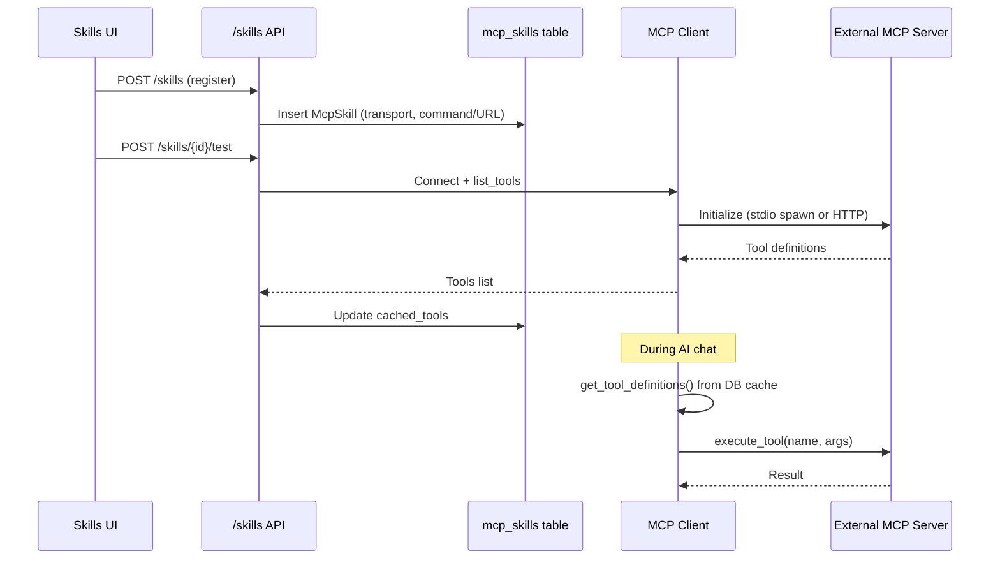

- **Transport**: `stdio` (spawn a local process) or `http` (SSE-based MCP HTTP transport).
- **Naming**: Tools are prefixed as `mcp_{slug}__{tool_name}` to avoid collisions with built-in tools.
- **Pooling**: HTTP connections are pooled with a configurable TTL; stdio connections are not pooled (process per call).
- **Builtin skills**: Seeded on startup via `seed_builtin_skills()`.

---

## 6. Context Pack System

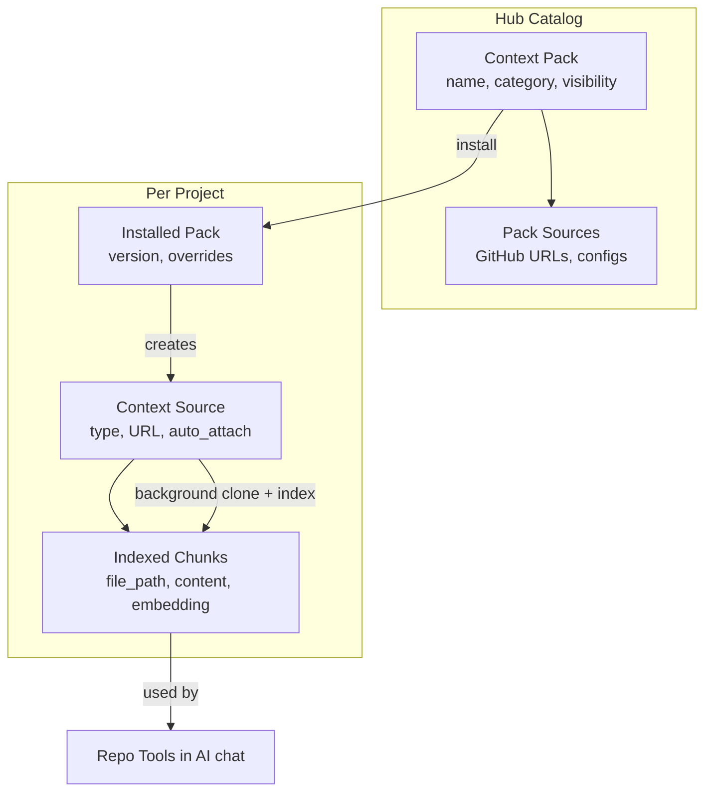

- **Hub packs** are shared catalog items (public, org-scoped, or personal).
- **Installing** a pack into a project creates `ContextSource` entries and triggers background git cloning.
- **Indexed chunks** are used by repo tools for file browsing and search during AI chat.
- Embeddings column exists (`vector(1536)` via pgvector) but embedding generation is deferred to a future worker.

---

## 7. Secrets & Vault

```mermaid
graph TD
    User[User creates secret<br/>via UI or API]
    User --> SS[Secret Service]
    SS -->|AES-256-GCM| SV[Secret Vault<br/>key = SHA256 of SECRET_KEY]
    SV --> DB[(project_secrets<br/>encrypted_value + nonce + tag)]

    AI[AI Chat tool input<br/>"use {{secret:MY_KEY}}"]
    AI --> Resolve[resolve_secrets]
    Resolve -->|decrypt| SV
    Resolve -->|inject plaintext| Tool[Tool Execution]
    Tool -->|redacted in response| AI

    SS -->|every access| Audit[(secret_audit_logs)]
```

- Secrets are encrypted at rest using AES-256-GCM with a key derived from `SECRET_KEY` (SHA-256 hash).
- The `{{secret:name}}` placeholder syntax lets the AI reference secrets in tool inputs without seeing the plaintext.
- `secret_scanner.py` scans user messages for accidentally pasted secrets before they reach the AI.

---

## 8. Cluster Management

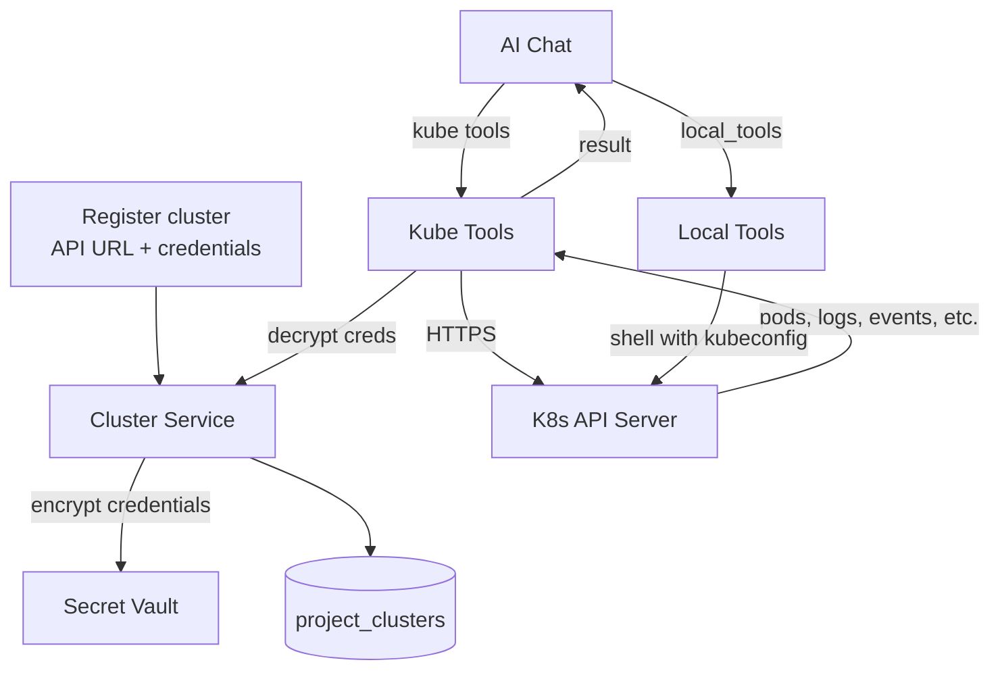

- Cluster credentials are encrypted with the same vault as secrets.
- `kube_tools.py` provides AI-callable functions for listing pods, reading logs, describing resources, and more.
- `local_tools.py` provides shell execution with an injected kubeconfig for advanced operations.

---

## 9. Frontend

### 9.1 Directory Layout

```
frontend/src/
├── App.tsx              # Routes
├── main.tsx             # Entry: BrowserRouter + QueryClient + AuthGate
├── app.css              # Tailwind + CSS variables design system
├── api/                 # Axios/fetch API modules (one per backend area)
├── stores/              # Zustand stores (UI + session state)
├── pages/               # Route-level components
│   ├── ProjectList.tsx
│   ├── ProjectDetail.tsx
│   ├── SessionView.tsx  # IDE-style: explorer + chat + editor
│   ├── SettingsPage.tsx
│   └── WorkflowsPage.tsx
├── components/
│   ├── Chat/            # ChatPanel, ThreadPanel, ActivityStream
│   ├── Layout/          # MainLayout, Sidebar, TopBar
│   ├── Orbi/            # AI mascot (CSS dog)
│   ├── ContextHub/      # Pack catalog UI
│   ├── ContextManager/  # Context sources + layers
│   ├── Clusters/        # Cluster CRUD UI
│   ├── SecretVault/     # Vault + scanner UI
│   ├── Skills/          # MCP skills UI
│   ├── Editor/          # Monaco editor panel
│   └── ...
├── lib/                 # Utilities (auth, tokens, product tour)
└── types/               # TypeScript interfaces
```

### 9.2 Routing

| Path | Component | Layout |
|------|-----------|--------|
| `/projects` | `ProjectList` | Sidebar visible |
| `/projects/:id` | `ProjectDetail` | Sidebar visible, tabs for sessions/context/clusters/secrets |
| `/projects/:id/sessions/:sid` | `SessionView` | Full-width IDE (sidebar hidden) |
| `/hub` | `HubCatalog` | Sidebar visible |
| `/hub/:packId` | `PackDetail` | Sidebar visible |
| `/skills` | `SkillCatalog` | Sidebar visible |
| `/workflows` | `WorkflowsPage` | Sidebar visible |
| `/settings` | `SettingsPage` | Sidebar visible |

### 9.3 State Management

**Zustand** for UI/session state, **TanStack Query** for server cache.

| Store | Purpose |
|-------|---------|
| `sessionStore` | Active session, messages array, add/set/clear |
| `threadStore` | Active thread, thread messages, streaming state |
| `activityStore` | Streaming text, tool activities, elapsed time |
| `projectStore` | Current project reference |
| `authStore` | User, token, auth mode, login/logout |
| `editorStore` | Monaco editor tabs (open files) |
| `themeStore` | Dark/light theme with localStorage persistence |
| `orbiStore` | Mascot state (idle/thinking/happy/sleeping), preferences |
| `secretStore` | Vault secrets list, scan warnings |
| `contextHubStore` | Hub search query, selected category filter |

### 9.4 API Layer

- **`api/client.ts`** — Shared Axios instance with base URL `/api`, JWT Bearer header from stored token, 401 interceptor for session expiry.
- **Dev proxy** — Vite proxies `/api` → `http://localhost:8000` (strips `/api` prefix).
- **Production** — nginx in the frontend container proxies `/api/` → backend container.

### 9.5 Streaming Chat

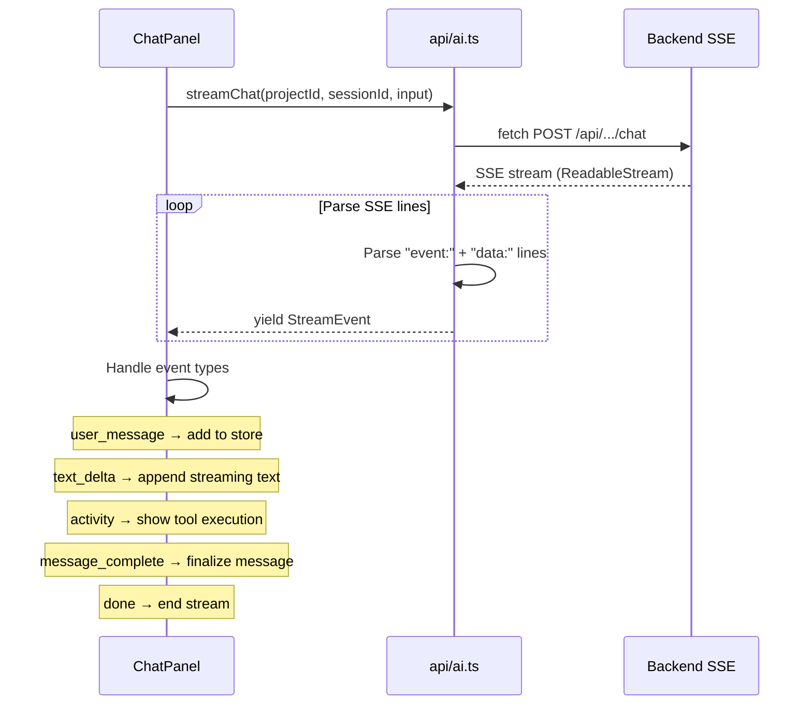

Chat does **not** use WebSocket. It uses `fetch()` with `response.body.getReader()` to read SSE events from an HTTP POST response body.

---

## 10. Authentication

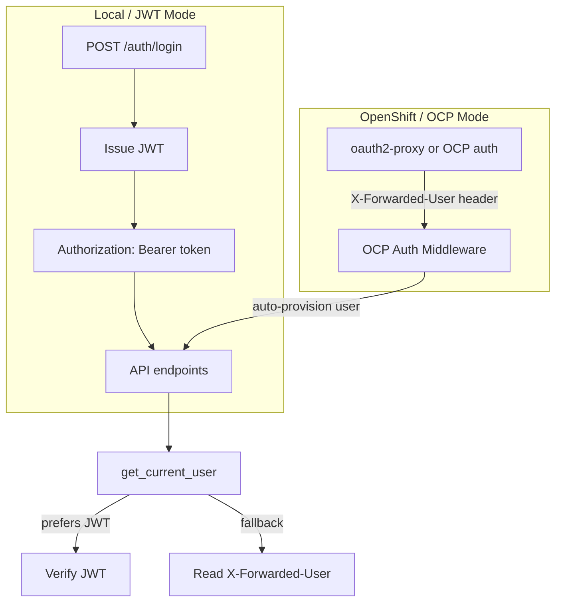

- **Local**: Standard username/password → JWT Bearer token flow.
- **OpenShift**: The `OCPAuthMiddleware` reads `X-Forwarded-User` / `X-Forwarded-Email` headers set by oauth2-proxy or OCP's built-in auth. Users are auto-provisioned in the DB on first access.
- Auth mode is detected by checking for `KUBERNETES_SERVICE_HOST` in the environment.

---

## 11. Deployment

### 11.1 Local Development (Compose)

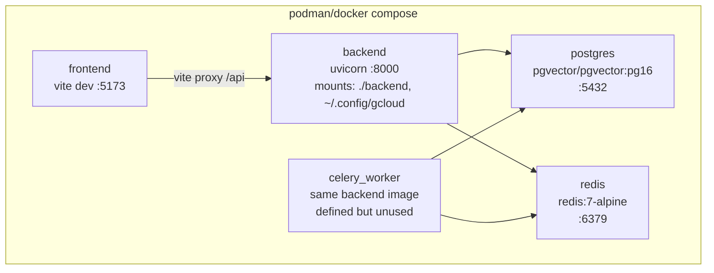

**Key points:**
- `~/.config/gcloud` is mounted read-only for Vertex AI ADC authentication.
- Override with `GOOGLE_APPLICATION_CREDENTIALS_DIR` env var if gcloud config is elsewhere.
- Backend runs with live code mount (`./backend:/app`) for hot reload.
- Frontend runs Vite dev server (not nginx) in development.

### 11.2 OpenShift (Manual Scripts)

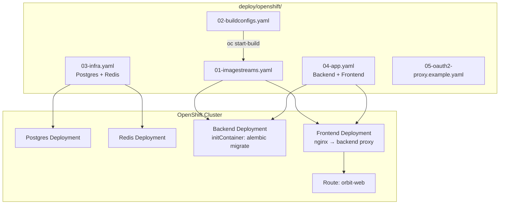

Run `deploy/openshift/build-deploy.sh` which:
1. Applies ImageStreams + BuildConfigs
2. Builds backend/frontend images from source
3. Deploys Postgres + Redis (03-infra.yaml)
4. Deploys backend (with DB migration initContainer) + frontend (04-app.yaml)
5. Creates the Route and sets CORS

### 11.3 OpenShift (Operator)

The [orbit-operator](https://github.com/GowthamShanmugam/orbit-operator) is a separate Kubernetes operator that automates the full deployment from a single custom resource (`OrbitInstance`). It provisions Postgres, Redis, backend, frontend, Celery worker, TLS route, and authentication.

---

## 12. Data Flow Diagrams

### User Sends a Chat Message (End-to-End)

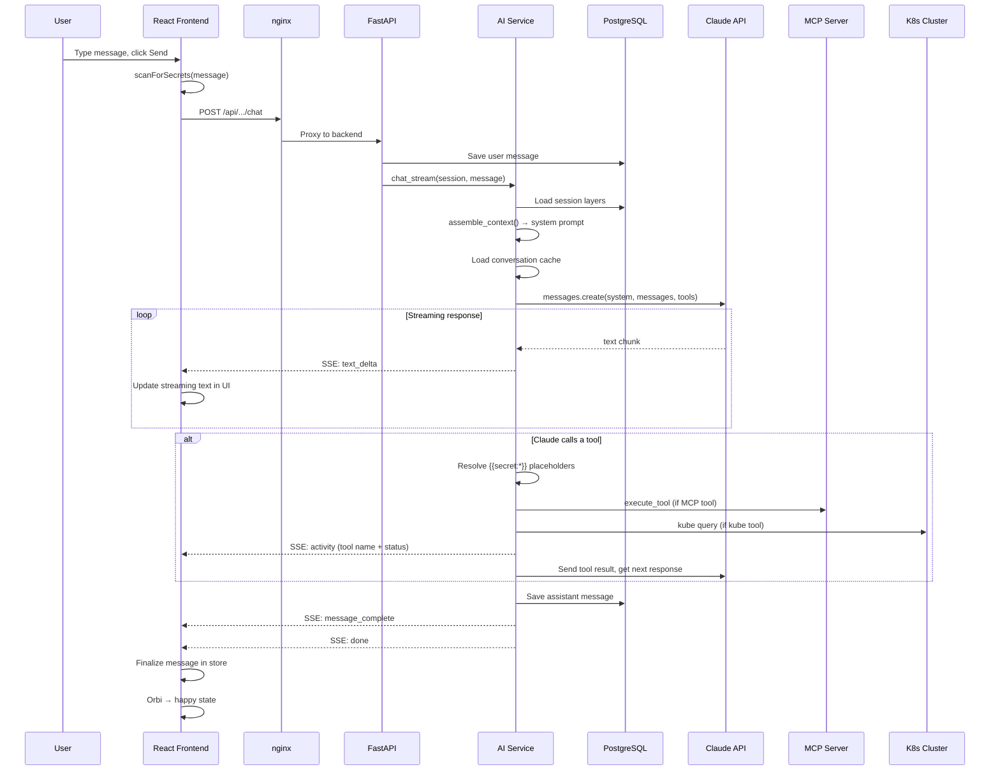

### Context Pack Installation

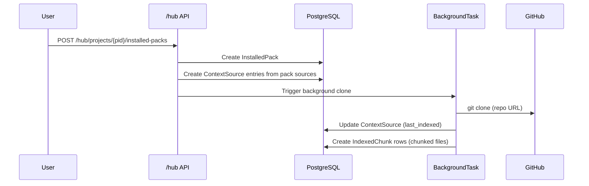
